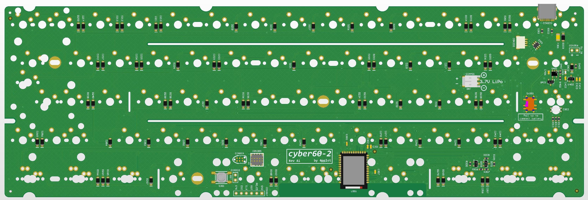

# cyber60

Repo for experimental keyboard PCB's using nRF52840, the cyber.

## Status:
CAUSION, project is being tested and only an early rough ZMK-implementation is done (not in main repo, check my fork)

## Specs cyber60:
- Module: Holyiot YJ-18010
- Standard Tray Mount support
- Non constant drain battery measurement
- Lipo charger
- RGB-led under Capslock for multi function indicator
- Possible to build with just a soldering iron (no underside pads etc)

## Layout support cyber60:

## Altium view of - cyber60

## Revisions:
A1 - initial revision/prototype
A2 - flipped PMOS-transistor, error in design. Added pulldown on enable to battery voltage measurement circuit, so it does not have to be disabled in code, only enabled. Minor silkscreen changes.
