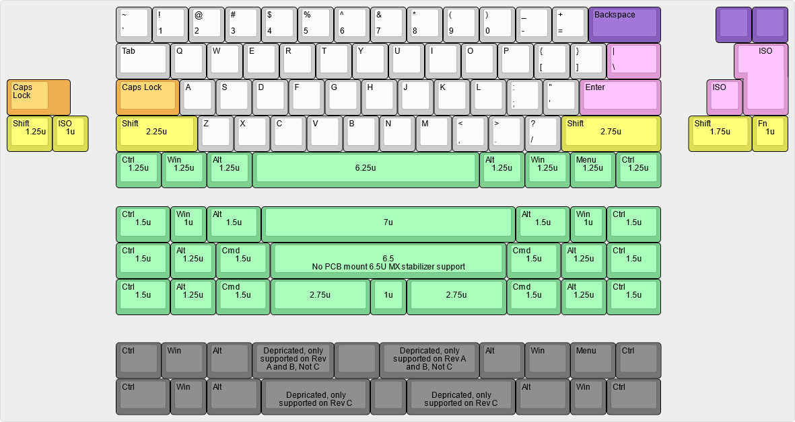
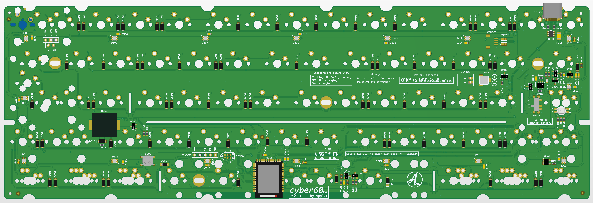
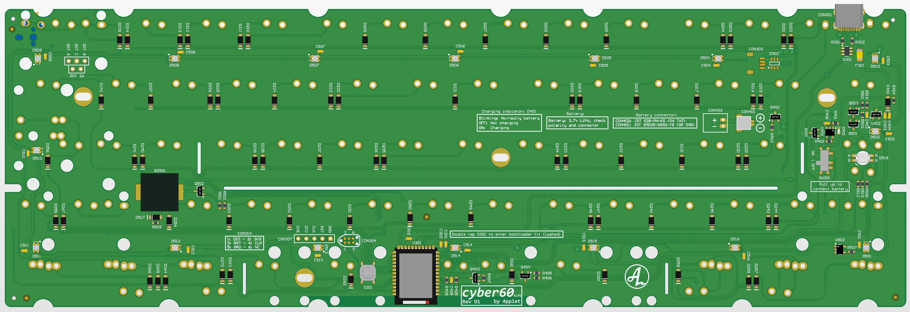
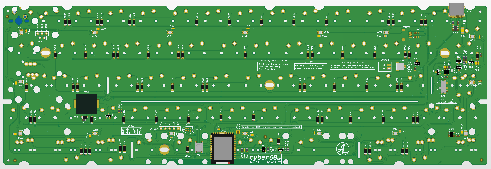
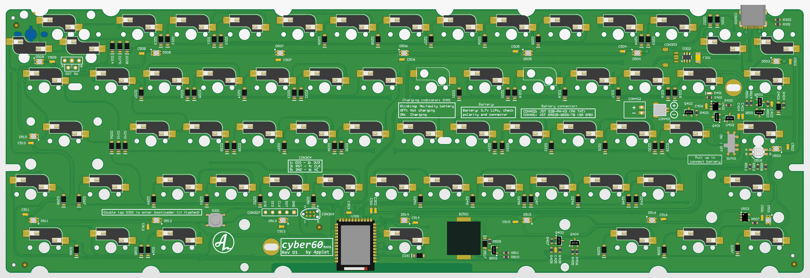
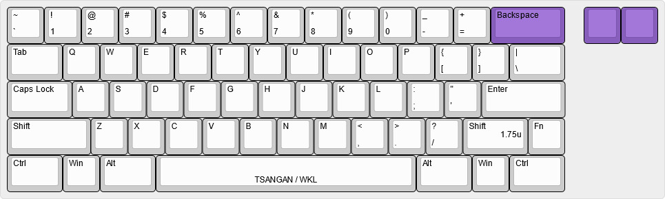

# cyber60

A DIY-friendly 60% using nRF52840 and ZMK: the cyber.

## Status:
Revision C3 is mostly tested and works. Please read release notes for specific release before manufacturing. I've added the release of revision D with updated split space layout. Files are still untested, so use at your own risk, untill it has been verified.

Buzzer and capslock indicator is not yet implemented in Zephyr 3.0.

Split space has been updated to 2.75u + 1u + 2.75u (6.5u split) instead of 3u + 1u + 3u (7u split) in the lates revision (D) for better stabilizer support. Only 2U PCB-stabilizers was previously supported for 3u, which is not ideal but 3U stabs do not fit due to the bluetooth module placment. 6.5u split is very similar in typing, but it will only work in WK or HHKB layout, not WKL.

## Availability:
As an option to DIY, I'll try and keep these available for purchase here: https://4pplet.com/ For DIY, the production files are avaliable in releases.

## Software:
- Link to zmk-fork: https://github.com/4pplet/zmk
- Link to zmk-config (uf2-files in actions): https://github.com/4pplet/zmk-config-4pplet

## Instructions:
- How to flash/update bootloader: [Link](./BL_FLASH_INSTRUCTION.md)
- How to flash/update ZMK: IN WORK

## Specs cyber60:
- Module: Holyiot YJ-18010
- Standard Tray Mount support (need battery cutout for internal battery)
- "rubber worm"-mount support (both bakeneko v1 and bakeneko v3). Case still need battery cutout for internal battery.
- Non constant drain battery measurement
- Lipo charger for single cell 3.7V li-po/li-ion batteries
- RGB-led under Capslock for multi function indicator, not supported on SMK-version. (compatible led: https://www.aliexpress.com/item/32834911790.html)
- Possible to build with just a soldering iron (no underside pads etc)
- Three versions running the same FW-implementation. One MX, one ALPS, one SMK
- USB horizontal placement is classic GH60, same as GH60, plain60, voyager60 etc.
- (rev b and newer) Underglow for cozy glow
- (rev b and newer) Buzzer for indicator or sweet tunes
- (rev b and newer) Rotary encoder at right most posision in split backspace or off board (compatible encoder: https://www.aliexpress.com/item/1005001265188249.html)
- (rev b and newer) Reverse polarity protection for battery
- (rev c and newer) Transistor stage for battery voltage measurement cutoff for no leak current when not measuring battery voltage (like in rev A).

## Todo:
- Verify revision D hardware
- Implement anti-shear hotswap footprints for the mx hotswap version.
- Make bootloader and ZMK implementation of revision D. Code for recision C can be used for now, it is fully compatible with revision D.

# Layout support (non hotswap):

**Note: No PCB mount stabilizer is supported for 6.5u, if 6.5u is used, a plate mount stabilizer is required.**

# MX-version:

## MX Revisions:
- A1 - initial revision/prototype
- A2 (prerelease) - flipped PMOS-transistor error in Rev A1. Added pulldown on enable to battery voltage measurement circuit, so it does not have to be disabled in code, only enabled. Minor silkscreen changes.
- B1 (prerelease) - Adding underglow, buzzer and rotary support. Simplifying voltage measurement circuit (tiny bit more leak current). Changing matrix to duplex.
- B2: Fixing underglow issue, adding n mos to fully turn off the p mos that powers the underglow. Adding reverse polarity protection for the battery.
- C1: Changing layout support for better solderability of module. Adding transistor cutoff for battery voltage measurement for no leak current. Switching to ws2812c in 2020-package. Rotating ANSI-enter stabilizer 180 degrees.
- C2: Minor adjustments to pads and soldermask
- D1: Removed 3U split space support, added 6.5u split into 2.75u + 1u + 2.75u.

# ALPS-version

## ALPS Revisions:
- A1 - initial revision/prototype, builds on MX rev A2
- B1 (prerelease) - Adding underglow, buzzer and rotary support. Simplifying voltage measurement circuit (tiny bit more leak current). Changing matrix to duplex.
- B2: Fixing underglow issue, adding n mos to fully turn off the p mos that powers the underglow. Adding reverse polarity protection for the battery.
- C1: Changing layout support for better solderability of module. Adding transistor cutoff for battery voltage measurement for no leak current. Switching to ws2812c in 2020-package. Rotating ANSI-enter stabilizer 180 degrees.
- C2: Minor adjustments to pads and soldermask
- D1: Removed 3U split space support

# SMK-version

## SMK Revisions:
- A1: Initial revision/prototype, builds on ALPS rev A1
- B1: (prerelease) - Adding underglow, buzzer and rotary support. Simplifying voltage measurement circuit (tiny bit more leak current). Changing matrix to duplex.
- B2: Fixing underglow issue, adding n mos to fully turn off the p mos that powers the underglow. Adding reverse polarity protection for the battery.
- C1: Changing layout support for better solderability of module. Adding transistor cutoff for battery voltage measurement for no leak current. Switching to ws2812c in 2020-package. Rotating ANSI-enter stabilizer 180 degrees.
- C2: Minor adjustments to pads and soldermask
- D1: Removed 3U split space support

# MX Hot swap-version

## Layout support:

## MXHS Revisions:
- C1: Initial revision, based on MX C1.
- C2: Minor adjustments to pads and soldermask
- D1: Removed 3U split space support

<a href='https://ko-fi.com/4pplet' target='_blank'>
