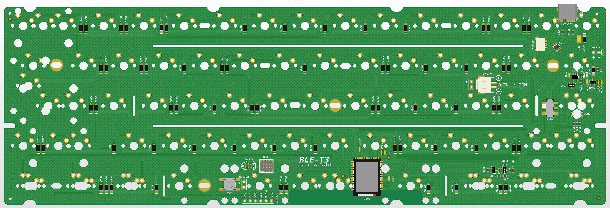

Repo for experimental keyboard PCB's using nRF52840.

## Status:
Prototyping phase.

# BLE-T2

## Layout support BLE-T2: 

## Altium view of - BLE-T2

## Specs BLE-T2:
- Module: Minew MS88SF2

## Revisions:
A1 - initial revision/prototype

# BLE-T3

## Layout support BLE-T3: 

## Altium view of - BLE-T3

## Specs BLE-T3:
- Module: Holyiot YJ-18010

## Revisions:
A1 - initial revision/prototype
