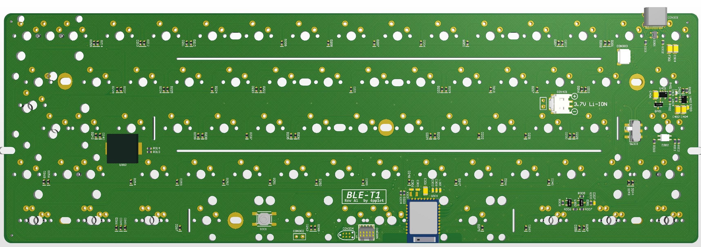
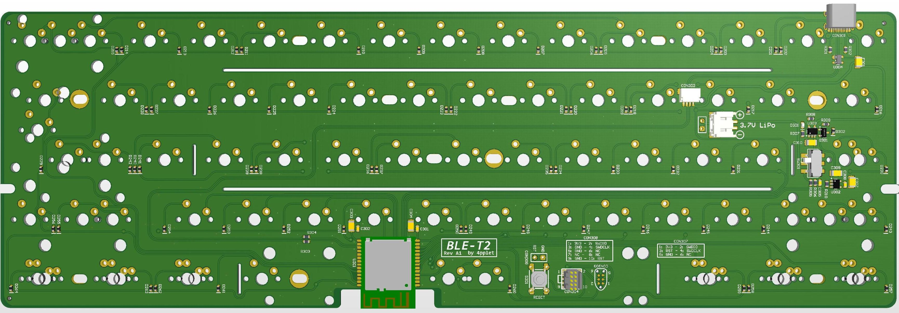

Repo for experimental keyboard PCB's using nRF52840.

## Status:
Prototyping phase.

## Some features:

# BLE-T1

## Layout support BLE-T1: 

## Altium view of PCB - BLE-T1

## Specs BLE-T1:
- Module: CDEBYTE E73-2G4M08S1C

## Revisions:
A1 - initial revision/prototype

# BLE-T2

## Layout support BLE-T2: 

## Altium view of - BLE-T2

## Specs BLE-T2:
- Module: Minew MS88SF2

## Revisions:
A1 - initial revision/prototype
