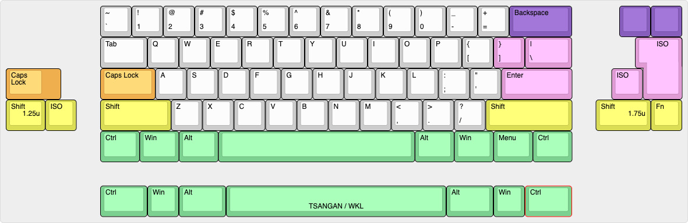
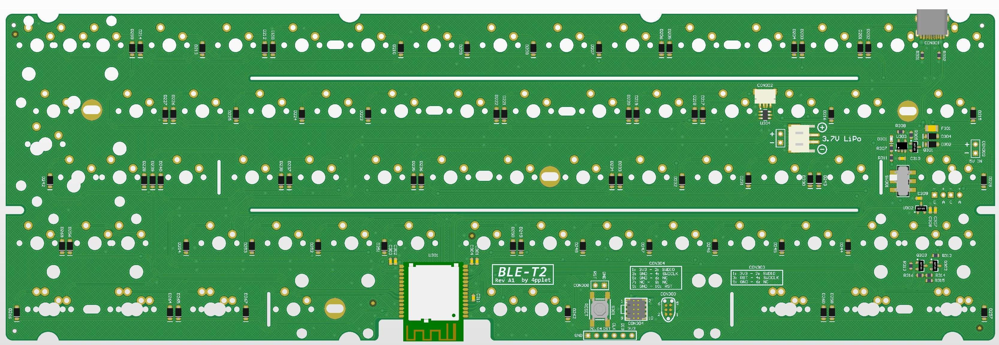
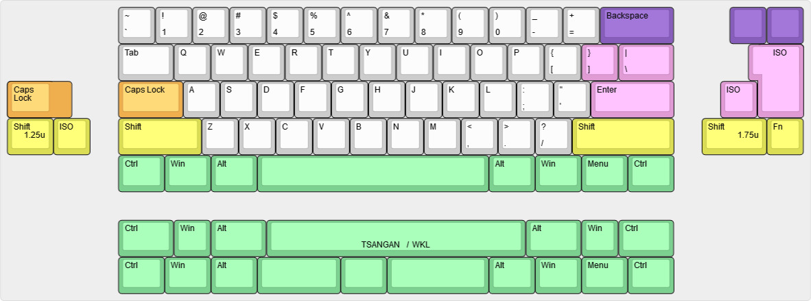
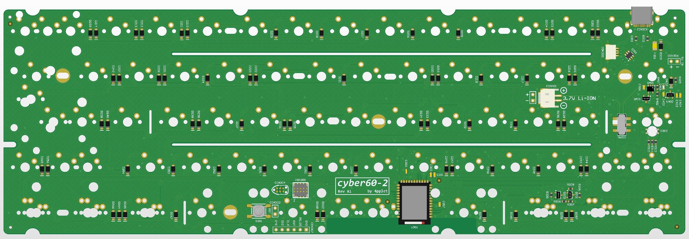

Repo for experimental keyboard PCB's using nRF52840, the cyber.

## Status:
Prototyping phase.

# cyber60_1

## Specs cyber60_1:
- Module: Minew MS88SF2
- Standard Tray Mount support
- Non constant drain battery measurement
- Lipo charger

## Layout support cyber60_1:

## Altium view of - cyber60_1

## Revisions:
A1 - initial revision/prototype

# cyber60_2

## Specs cyber60_2:
- Module: Holyiot YJ-18010
- Standard Tray Mount support
- Non constant drain battery measurement
- Lipo charger
- RGB-led under Capslock for multi function indicator

## Layout support cyber60_2:

## Altium view of - cyber60_2

## Revisions:
A1 - initial revision/prototype
