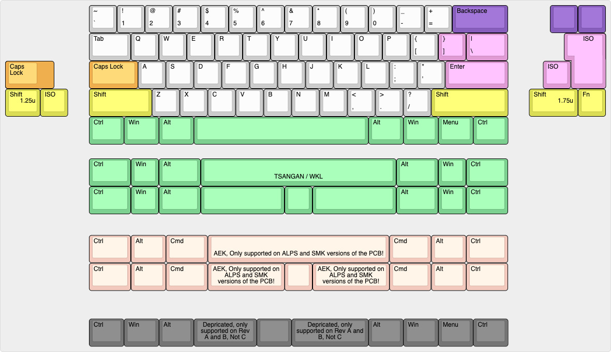
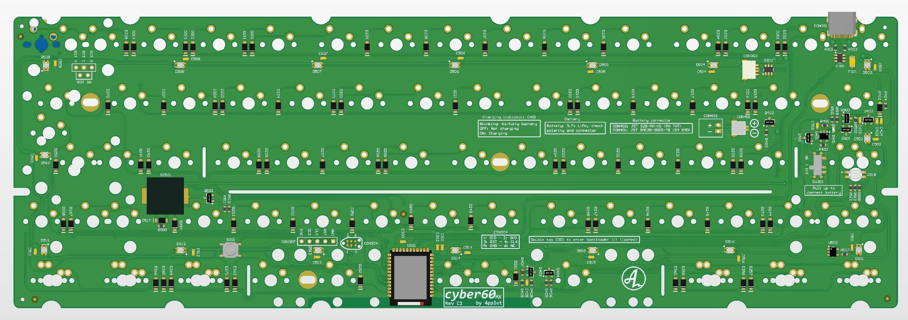
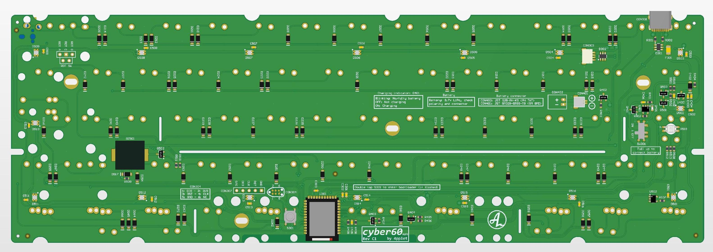
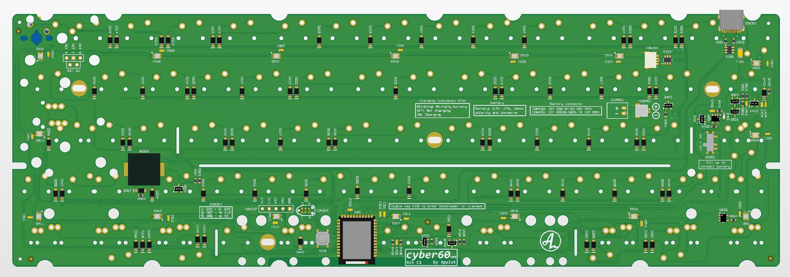
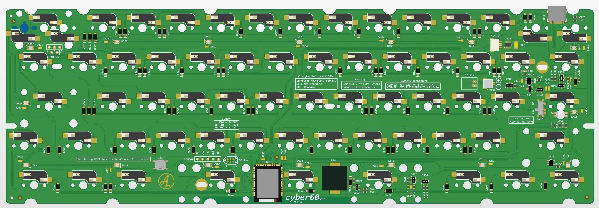
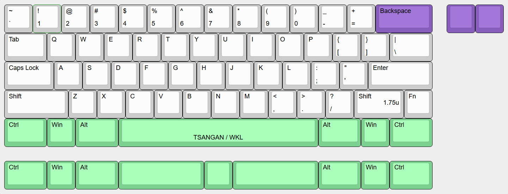

# cyber60

A DIY-friendly 60% using nRF52840 and ZMK: the cyber.

## Status:
**CAUTION**: Revision B2 is fully tested and works. If you want to use Revision A: Use Rev A2 for MX or Rev A1 for SMK and ALPS. Rev A1 MX has a flipped transistor. Revision C is currently being prototyped, no ZMK implementation is done.

## Software:
- Link to zmk-fork: https://github.com/4pplet/zmk-config
- Link to zmk-config (uf2-files in actions): https://github.com/4pplet/zmk-config
- Bootloader used: pca10056_bootloader-0.3.2_s140_6.1.1.hex

## Specs cyber60:
- Module: Holyiot YJ-18010
- Standard Tray Mount support (need battery cutout for internal battery)
- "rubber worm"-mount support (both unikorn and bakeneko v3). Case still need battery cutout for internal battery.
- Non constant drain battery measurement
- Lipo charger for single cell 3.7V li-po/li-ion batteries
- RGB-led under Capslock for multi function indicator (not on SMK-version)
- Possible to build with just a soldering iron (no underside pads etc)
- Three versions running the same FW-implementation. One MX, one ALPS, one SMK
- USB horizontal placement is classic GH60, same as GH60, plain60, voyager60 etc.
- (rev b) Underglow for cozy glow
- (rev b) Buzzer for indicator or sweet tunes
- (rev b) Rotary encoder at right most posision in split backspace or off board
- (rev b) Reverse polarity protection for battery
- (rev c) Transistor stage for battery voltage measurement cutoff for no leak current when not measuring battery voltage (like in rev A).

## Todo:
- Properly verify current consumption
- Properly verify charge current
- Implement buzzer and RGB capslock-led in ZMK
- Fork bootloader and add support for bootloader indication on capslock led.

# Layout support (non hotswap):

# MX-version:

## MX Revisions:
- A1 - initial revision/prototype
- A2 (prerelease) - flipped PMOS-transistor error in Rev A1. Added pulldown on enable to battery voltage measurement circuit, so it does not have to be disabled in code, only enabled. Minor silkscreen changes.
- B1 (prerelease) - Adding underglow, buzzer and rotary support. Simplifying voltage measurement circuit (tiny bit more leak current). Changing matrix to duplex.
- B2: Fixing underglow issue, adding n mos to fully turn off the p mos that powers the underglow. Adding reverse polarity protection for the battery.
- C1: Changing layout support for better solderability of module. Adding transistor cutoff for battery voltage measurement for no leak current. Switching to ws2812c in 2020-package. Rotating ANSI-enter stabilizer 180 degrees.

# ALPS-version

## ALPS Revisions:
- A1 - initial revision/prototype, builds on MX rev A2
- B1 (prerelease) - Adding underglow, buzzer and rotary support. Simplifying voltage measurement circuit (tiny bit more leak current). Changing matrix to duplex.
- B2: Fixing underglow issue, adding n mos to fully turn off the p mos that powers the underglow. Adding reverse polarity protection for the battery.
- C1: Changing layout support for better solderability of module. Adding transistor cutoff for battery voltage measurement for no leak current. Switching to ws2812c in 2020-package. Rotating ANSI-enter stabilizer 180 degrees.

# SMK-version

## SMK Revisions:
- A1: Initial revision/prototype, builds on ALPS rev A1
- B1: (prerelease) - Adding underglow, buzzer and rotary support. Simplifying voltage measurement circuit (tiny bit more leak current). Changing matrix to duplex.
- B2: Fixing underglow issue, adding n mos to fully turn off the p mos that powers the underglow. Adding reverse polarity protection for the battery.
- C1: Changing layout support for better solderability of module. Adding transistor cutoff for battery voltage measurement for no leak current. Switching to ws2812c in 2020-package. Rotating ANSI-enter stabilizer 180 degrees.

# MX Hot swap-version

## Layout support:

## MXHS Revisions:
- C1: Initial revision, based on MX C1.

## Note:
- Voltage measurement and power consumption for revision A1/A2 is not fully verified
- RGB-led is not implemented in ZMK yet
- Buzzer support is not implemented in ZMK yet
