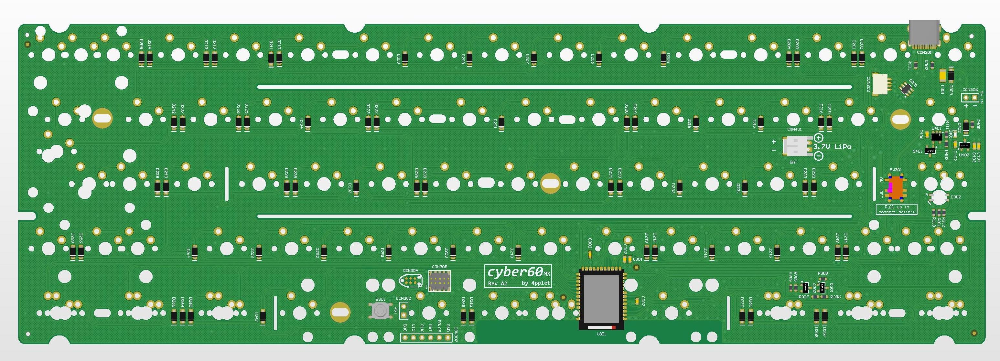
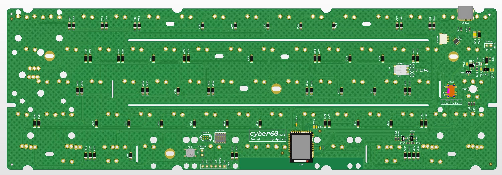
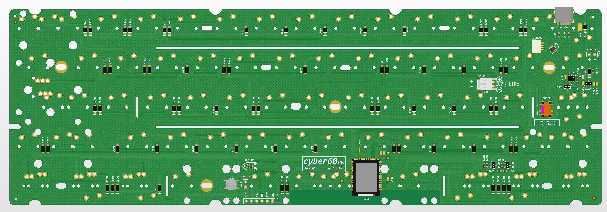

# cyber60

A DIY-friendly 60% using nRF52840 and ZMK: the cyber.

## Status:
CAUSION, project is being tested and only an early rough ZMK-implementation is done (not in main repo, check my fork). Bugs in Rev A1, use prereleased A2 if you want to give it a go. ALPS and SMK-version is done, but untested.

## Specs cyber60:
- Module: Holyiot YJ-18010
- Standard Tray Mount support
- Non constant drain battery measurement
- Lipo charger for single cell 3.7V li-po/li-ion batteries
- RGB-led under Capslock for multi function indicator (not on SMK-version)
- Possible to build with just a soldering iron (no underside pads etc)
- Three versions running the same FW-implementation. One MX, one ALPS, one SMK.

## Todo:
- Verify current consumption
- Verify charge current
- Implement RGB-led in ZMK
- Verify voltage measurement circuit in ZMK (not tested in code)

# MX-version
## Layout support cyber60 MX-version:

## Altium view of - cyber60 MX-version:

## MX Revisions:
- A1 - initial revision/prototype
- A2 (prerelease) - flipped PMOS-transistor, error in design. Added pulldown on enable to battery voltage measurement circuit, so it does not have to be disabled in code, only enabled. Minor silkscreen changes.

# ALPS-version
## Layout support cyber60 ALPS-version:

## Altium view of - cyber60 ALPS-version:

## ALPS Revisions:
- A1 - initial revision/prototype, builds on MX rev A2

# SMK-version
## Layout support cyber60 SMK-version:

## Altium view of - cyber60 SMK-version:

## SMK Revisions:
- A1 - initial revision/prototype, builds on ALPS rev A1
