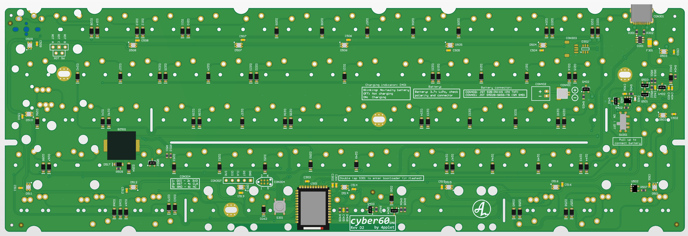
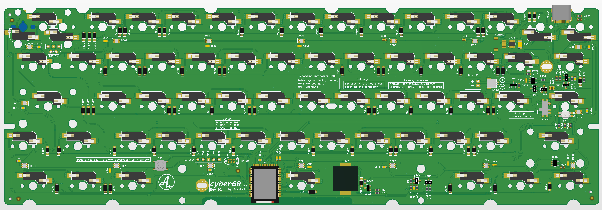
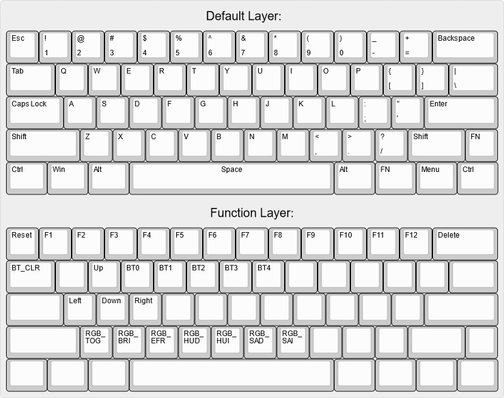

# cyber60

A DIY-friendly 60% using nRF52840 and ZMK: the cyber.

Verified compatibility list: [Link](./COMPAT.md)

## Availability:
As an option to DIY, I'll try and keep these available for purchase here: https://4pplet.com/ For DIY, the production files are avaliable in releases.

## Software:
- Link to zmk-fork: https://github.com/4pplet/zmk
- Link to zmk-config (uf2-files in actions): https://github.com/4pplet/zmk-config-4pplet

## Instructions:
- How to flash/update bootloader (this is needed to be able to flash firmware via USB): [Link](./instructions/BL_FLASH_INSTRUCTION.md)
- How to flash/update firmware using ZMK-config: [Link](./instructions/ZMK-config_steps.md)
- How to flash/update firmware using ZMK-repo (most difficult): [Link](./instructions/ZMK_steps.md)
- How to edit the ZMK-config repo using keymap-editor (easiest): [Link](./instructions/ZMK_keymap-editor.md)

## Specs cyber60:
- Module: Holyiot YJ-18010 for rev A-D, E73-2G4M08S1C for rev E
- Standard Tray Mount support (need battery cutout for internal battery)
- "rubber worm"-mount support (both bakeneko v1 and bakeneko v3). Case still need battery cutout for internal battery.
- Non constant drain battery measurement
- Lipo charger for single cell 3.7V li-po/li-ion batteries (recommended JST SH battery: https://www.upgradekeyboards.com/product/filament-power-batteries-ultra-thin-lipo/, if soldering JST PH, adafruit batteries work well, but make sure they are not too thick)
- RGB-led under Capslock for multi function indicator, not supported on SMK-version. (compatible led: https://www.aliexpress.com/item/1005003719602946.html)
- Possible to build with just a soldering iron (no underside pads etc)
- Three versions running the same FW-implementation. One MX, one ALPS, one SMK
- USB horizontal placement is classic GH60, same as GH60, plain60, voyager60 etc.
- (rev b and newer) Underglow for cozy glow
- (rev b and newer) Buzzer for indicator or sweet tunes
- (rev b and newer) Rotary encoder at right most posision in split backspace or off board (compatible encoder: https://www.aliexpress.com/item/1005001265188249.html)
- (rev b and newer) Reverse polarity protection for battery
- (rev c and newer) Transistor stage for battery voltage measurement cutoff for no leak current when not measuring battery voltage (like in rev A).

## Todo:
- Complete Alps and SMK versions of revision E and make releases.
- Improve flash/update ZMK instruction.

# Layout support (non hotswap):

# MX-version:

## MX Revisions:
- A1 - initial revision/prototype
- A2 (prerelease) - flipped PMOS-transistor error in Rev A1. Added pulldown on enable to battery voltage measurement circuit, so it does not have to be disabled in code, only enabled. Minor silkscreen changes.
- B1 (prerelease) - Adding underglow, buzzer and rotary support. Simplifying voltage measurement circuit (tiny bit more leak current). Changing matrix to duplex.
- B2: Fixing underglow issue, adding n mos to fully turn off the p mos that powers the underglow. Adding reverse polarity protection for the battery.
- C1: Changing layout support for better solderability of module. Adding transistor cutoff for battery voltage measurement for no leak current. Switching to ws2812c in 2020-package. Rotating ANSI-enter stabilizer 180 degrees.
- C2: Minor adjustments to pads and soldermask
- D1: Removed 3U split space support, added 6.5u split into 2.75u + 1u + 2.75u.
- E1: Changed power curcuit (now high voltage mode), changed module, minor QOL changes

# ALPS-version

## ALPS Revisions:
- A1 - initial revision/prototype, builds on MX rev A2
- B1 (prerelease) - Adding underglow, buzzer and rotary support. Simplifying voltage measurement circuit (tiny bit more leak current). Changing matrix to duplex.
- B2: Fixing underglow issue, adding n mos to fully turn off the p mos that powers the underglow. Adding reverse polarity protection for the battery.
- C1: Changing layout support for better solderability of module. Adding transistor cutoff for battery voltage measurement for no leak current. Switching to ws2812c in 2020-package. Rotating ANSI-enter stabilizer 180 degrees.
- C2: Minor adjustments to pads and soldermask
- D1: Removed 3U split space support
- E1: Changed power curcuit (now high voltage mode), changed module, minor QOL changes

# SMK-version

## SMK Revisions:
- A1: Initial revision/prototype, builds on ALPS rev A1
- B1: (prerelease) - Adding underglow, buzzer and rotary support. Simplifying voltage measurement circuit (tiny bit more leak current). Changing matrix to duplex.
- B2: Fixing underglow issue, adding n mos to fully turn off the p mos that powers the underglow. Adding reverse polarity protection for the battery.
- C1: Changing layout support for better solderability of module. Adding transistor cutoff for battery voltage measurement for no leak current. Switching to ws2812c in 2020-package. Rotating ANSI-enter stabilizer 180 degrees.
- C2: Minor adjustments to pads and soldermask
- D1: Removed 3U split space support
- D2: Fixed error in footprint for backspace keys.
- E1: Changed power curcuit (now high voltage mode), changed module, minor QOL changes

# MX Hot swap-version

## Layout support:

## Default ZMK firmware:

## MXHS Revisions:
- C1: Initial revision, based on MX C1.
- C2: Minor adjustments to pads and soldermask
- D1: Removed 3U split space support
- D2: Changed to anti-shear footprints
- E1: Changed power curcuit (now high voltage mode), changed module, minor QOL changes

<a href='https://ko-fi.com/4pplet' target='_blank'>
