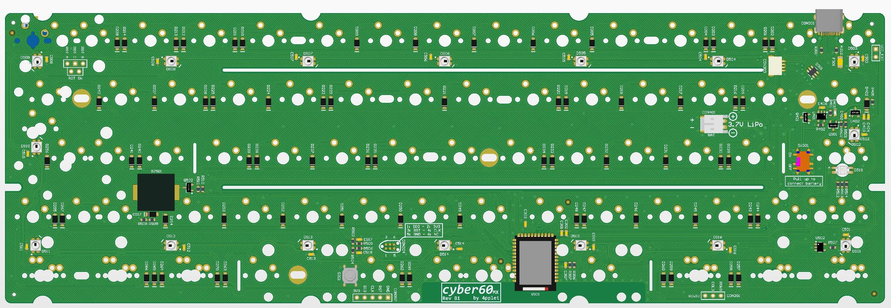
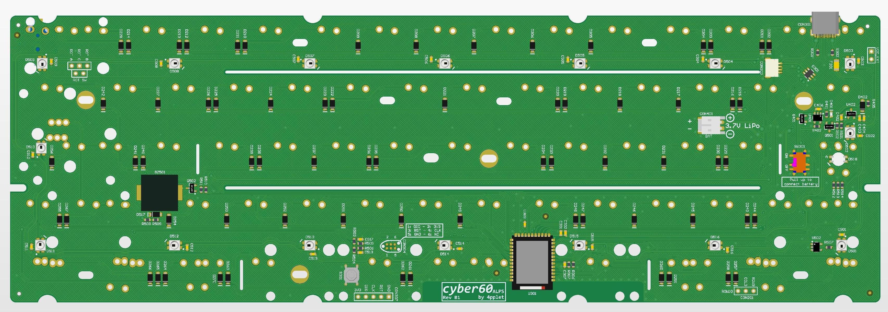
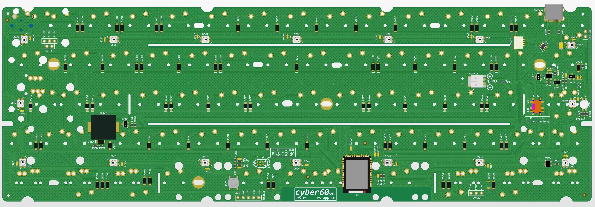

# cyber60

A DIY-friendly 60% using nRF52840 and ZMK: the cyber.

## Status:
**CAUSION**: Use Rev A2 for MX, flipped transistor in A1. SMK and ALPS Rev A1 does not have this issue. Revision B is currently being prototyped and adds rotary encoder support, underglow and buzzer. **Revision B is currently untested.**

## Software:
- Link to zmk-fork: https://github.com/4pplet/zmk-config
- Link to zmk-config (uf2-files in actions): https://github.com/4pplet/zmk-config
- Bootloader used: pca10056_bootloader-0.3.2_s140_6.1.1.hex

## Specs cyber60:
- Module: Holyiot YJ-18010
- Standard Tray Mount support
- Non constant drain battery measurement
- Lipo charger for single cell 3.7V li-po/li-ion batteries
- RGB-led under Capslock for multi function indicator (not under switch on SMK-version)
- Possible to build with just a soldering iron (no underside pads etc)
- Three versions running the same FW-implementation. One MX, one ALPS, one SMK
- USB horizontal placement is classic GH60, same as GH60, plain60, voyager60 etc.
- (rev b) Underglow for cozy glow
- (rev b) Buzzer for indicator or sweet tunes
- (rev b) Rotary encoder at right most posision in split backspace or off board

## Todo:
- Verify current consumption
- Verify charge current
- Make basic ZMK config for Rev B
- Implement buzzer, RGB capslock-led and underglow in ZMK

# MX-version
## Layout support cyber60 MX-version:

## Altium view of - cyber60 MX-version:

## MX Revisions:
- A1 - initial revision/prototype
- A2 (prerelease) - flipped PMOS-transistor error in Rev A1. Added pulldown on enable to battery voltage measurement circuit, so it does not have to be disabled in code, only enabled. Minor silkscreen changes.
- B1 (prerelease) - Adding underglow, buzzer and rotary support. Simplifying voltage measurement circuit (tiny bit more leak current). Changing matrix to duplex.

# ALPS-version
## Layout support cyber60 ALPS-version:

## Altium view of - cyber60 ALPS-version:

## ALPS Revisions:
- A1 - initial revision/prototype, builds on MX rev A2
- B1 (prerelease) - Adding underglow, buzzer and rotary support. Simplifying voltage measurement circuit (tiny bit more leak current). Changing matrix to duplex.

# SMK-version
## Layout support cyber60 SMK-version:

## Altium view of - cyber60 SMK-version:

## SMK Revisions:
- A1 - initial revision/prototype, builds on ALPS rev A1
- B1 (prerelease) - Adding underglow, buzzer and rotary support. Simplifying voltage measurement circuit (tiny bit more leak current). Changing matrix to duplex.

## Note:
- Voltage measurement and power consumption for revision A1/A2 is not fully verified
- RGB-led is not implemented in ZMK yet
- Buzzer support is not implemented in ZMK yet
- B-revision is still not tested and implemented.
