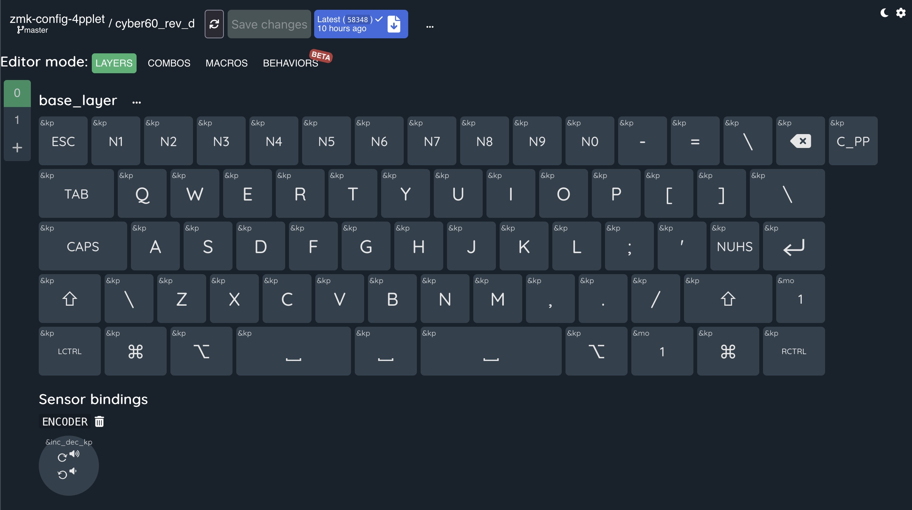
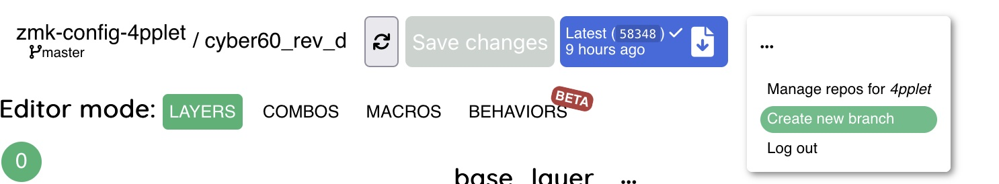

# Change keymap using keymap editor:
## 0: (prerequisite) for github
Create a github account and log in to it. If you don't use your own github account and fork, you will not be able to make any changes to the keymap.
## 1: Fork the ZMK-config repo
Open this URL in a browser and click the fork button: https://github.com/4pplet/zmk-config-4pplet
## 2: Open the editor and give it access
Open the editor in a bowser (https://nickcoutsos.github.io/keymap-editor/). You will now select your github fork you created in step 1 by clicking the "source" dropdown and change from "demo keyboard" to github. 

You get a dialoge to give the editor access to your forked repo on your github account.
## 3: Select your repo in the editor
If all went well in step 2, you should be able to select your forked repo in the dropdown and the cyber60 default layout will show.

## 4: (optional) create a branch for your keymap. 
You can also create your own branch for making keymap changes by pressing the three dots and click Create new branch.

This is totally optional, but it makes it easier to track and keep your changes.
## 5: Adjust keymap
Adjust the firmware using the tool and press "Save changes".
## 6: Wait for firmware to build
The blue button will get a check-mark when the firmware is ready to download. When it's done, press the blue button to get to the download page.
## 7: Download firmware
The firmware is avalable (if the build went well and it's done) if you scroll down to "artifacts". Click on "firmware" to start the download of a zip with your modified firmware. Do note: by default the revision D firmware will be modified. Read at the end for how to edit code for revision B or C with this tool.
## 8: Unpack the zip
Unpack this zip-file and you'll have the built firmware for all the different revisions. You need to use the one built for the revision you edited.
## 9: Set the PCB in reprogram mode (enter uf2 bootloader)
On the PCB, double click on the reset-button and it'll show up on your PC as a removable device.
## 9: Flash your edited firmware
To reflash the PCB, copy the generated .uf2 file from the unpacked .zip file into the removable device (or drag drop) and the PCB will be re-flashed with your modified changes.

# For editing keymap for revision B or C:
This is not strictly needed for revision C, it can run the same code as revision D. The only differences are physical on the PCB due to layout changes and minor tweaks.

# To change the layout on revision C or D:
## 1: Remove the rev D keymap
Remove the file "cyber60_rev_d.keymap" from zmk-config-4pplet/config/
## 2: Add the keymap for the revision you need
- For rev B: copy the file "cyber60_rev_b.keymap" from zmk-config-4pplet/config/cyber60_rev_c/ to zmk-config-4pplet/config/ to be able to configure revision B. Now you'll be able to follow the steps above.

- For rev C: copy the file "cyber60_rev_c.keymap" from zmk-config-4pplet/config/cyber60_rev_c/ to zmk-config-4pplet/config/ to be able to configure revision C. Now you'll be able to follow the steps above.

The other firmware files built by github actions will be the default firmwares unless changes have been made in the repo by the user.

# Updating the repo:
Your fork of 4pplets zmk-config-4pplet repo will not keep up to date automatically. To update the repo, you will need to do a git merge or rebase from the original repo.