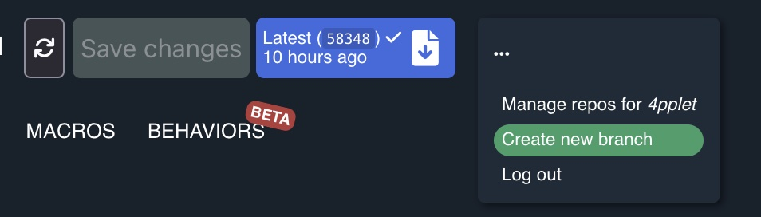

# Change keymap using keymap editor:
## 0: (prerequisite) for github
Create a github account and log in to it. If you don't use your own github account and fork, you will not be able to make any changes to the keymap.
## 1: Fork the ZMK-config repo
Open this URL in a browser and click the fork button: https://github.com/4pplet/zmk-config-4pplet

## 2: Open the editor and give it access
Open the editor in a browser (https://nickcoutsos.github.io/keymap-editor/). You will now select your github fork you created in step 1 by clicking the "source" dropdown and change from "demo keyboard" to github.

You get a dialogue to give the editor permission to access the forked repo on your github account.
## 3: Select your repo in the editor
If all went well in step 2, you should be able to select your forked repo in the dropdown and the cyber60 default layout will show.

This view will show all mappable switch positions. Not all will be able to be used at the same time. For example both backslash (above enter) and NUHS can be assigned but not used at the same time when using a normal ISO or ANSI layout. The switch with default mapping "C_PP" is the rotary encoder switch.
## 4: (optional) create a branch for your keymap
You can also create your own branch for making keymap changes by pressing the three dots and click Create new branch.

This is totally optional, but it makes it easier to track and keep your changes.
## 5: Adjust keymap
Adjust the keymap using the tool and press "Save changes".
## 6: Wait for firmware to build
The blue button will get a check-mark when the firmware is ready to download. When it's done, press the blue button to get to the download page.
## 7: Download firmware
The firmware is available (if the build went well and it's done) if you scroll down to "artifacts". Click on "firmware" to start the download of a zip with your modified firmware. By default the revision E firmware will be modified. Read at the end for how to edit code for other revisions with this tool.
## 8: Unpack the zip
Unpack this zip-file and you'll have the built firmware for all the different revisions. You need to use the one built for the revision you edited.
## 9: Set the PCB in reprogram mode (enter uf2 bootloader)
To flash the built firmware, the PCB needs to be put in reprogram/bootloader mode. With the default keymap, this can be done by pressing Fn + CapsLock. Alternatively, you can double click on the reset button on the PCB. When the keyboard enters this mode, key input will no longer work and a UF2 removable device will show up on your PC.
## 10: Flash your edited firmware
To reflash the PCB, copy the generated .uf2 file from the unpacked .zip file into the removable device (or drag drop) and the PCB will be re-flashed with your modified changes.

# To change the layout on other revisions:
By default, the keymap editor will modify the revision E keymap. To edit other revisions:

## 1: Remove the rev E keymap
Remove the file `cyber60_rev_e.keymap` from `zmk-config-4pplet/config/`
## 2: Add the keymap for the revision you need
Copy the keymap file for your revision to the config folder:
- For rev A: copy `cyber60_rev_a.keymap`
- For rev B: copy `cyber60_rev_b.keymap`
- For rev C: copy `cyber60_rev_c.keymap`
- For rev D: copy `cyber60_rev_d.keymap`

Now you'll be able to follow the steps above.

The other firmware files built by GitHub Actions will be the default firmwares unless changes have been made in the repo by the user.

# Updating the repo:
Your fork of 4pplet's zmk-config-4pplet repo will not keep up to date automatically. To update the repo, you will need to do a git merge or rebase from the original repo.
